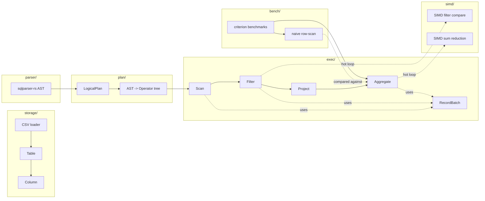
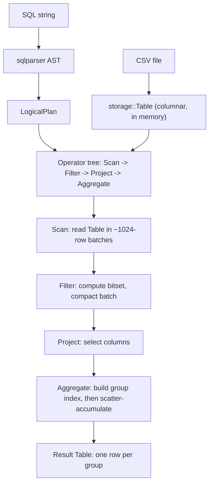
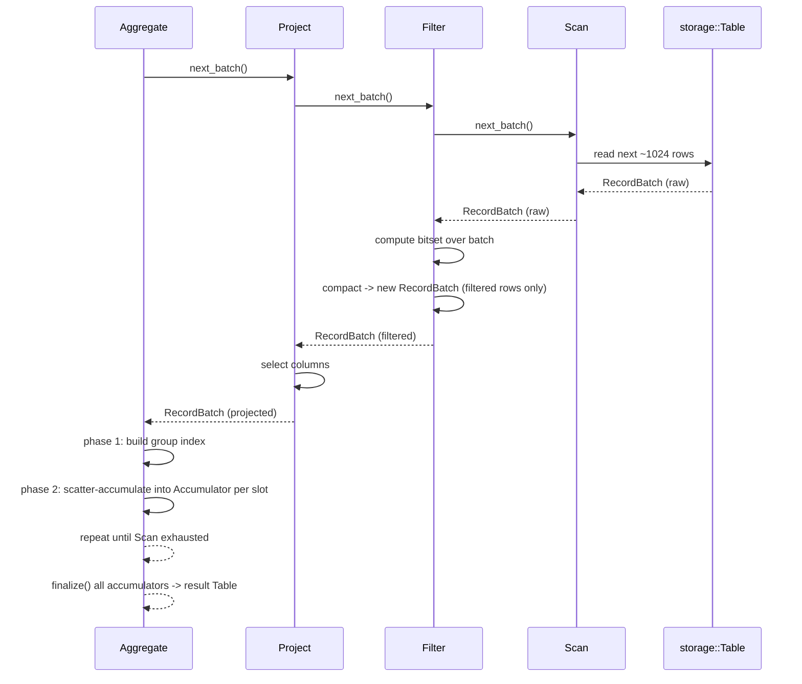
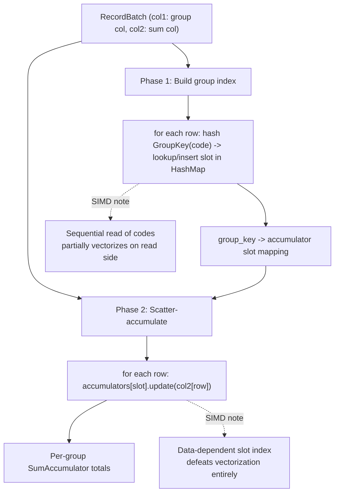
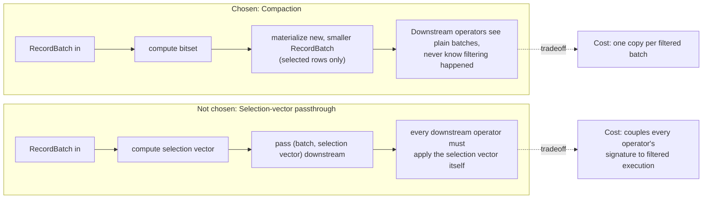
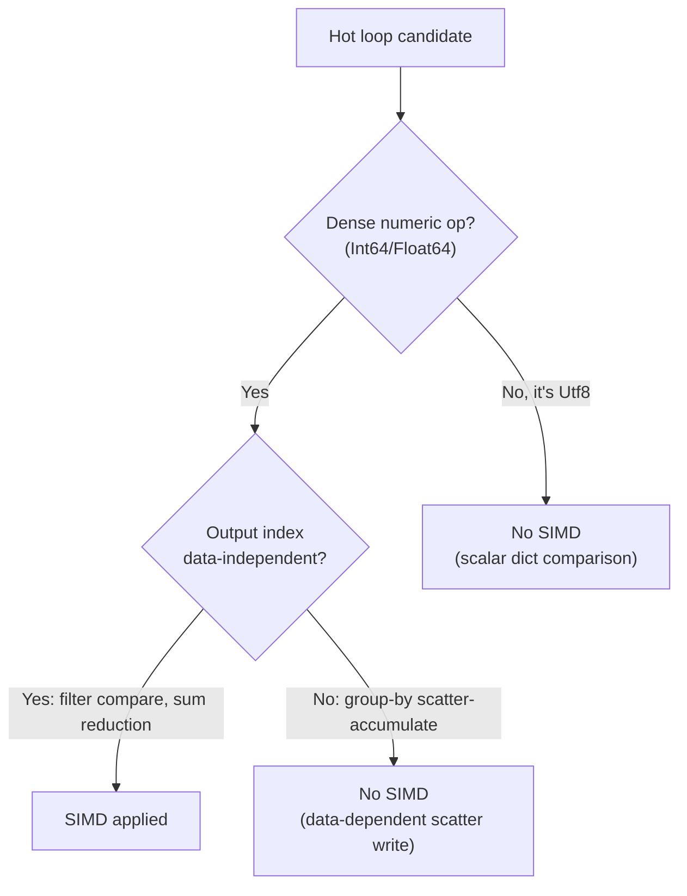
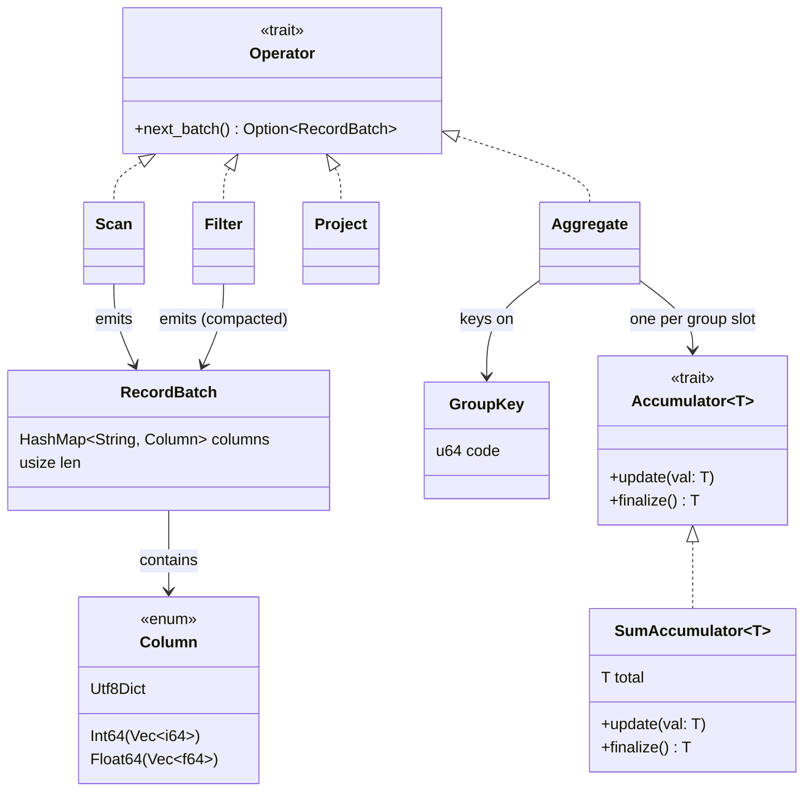
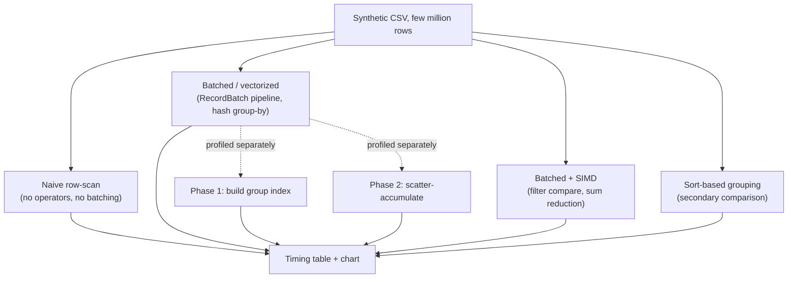
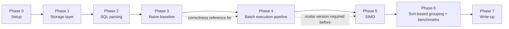

# Mermaid Diagrams

Reference diagrams for `architecture.md` and `systemDesign.md`. Paste any block into
a Mermaid renderer (or GitHub, which renders these natively in `.md` files).

## 1. Module / Crate Architecture

## 2. Query Execution Data Flow

## 3. Operator Pull Chain (sequence view)

## 4. Hash Group-By — Two-Phase Detail

## 5. Filter: Compaction vs. Selection-Vector Passthrough (tradeoff)

## 6. SIMD Applicability Map

## 7. Core Type Relationships

## 8. Benchmark Comparison Structure

## 9. Build Phases (flow)

